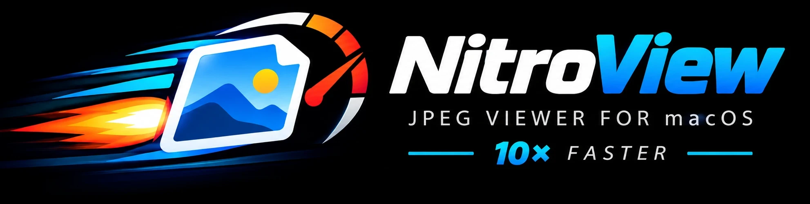

<p align="center"></p>

# jpeg-nitro

[English](README.md) | **Magyar**

**nitroview**: nagyon gyors képnéző macOS-re, három saját dekóderrel, amelyek egyetlen
képet is az összes CPU-magon dekódolnak — pedig a JPEG, a PNG és a PSD tömörítése is
eredendően soros:

| dekóder | formátum | hogyan | idő | szokásos dekóderek |
|---|---|---|---|---|
| **nitrojpeg** | baseline JPEG | spekulatív párhuzamos Huffman-dekódolás, AVX2 IDCT; bitre egyezik a libjpeg-turbóval | 24 MP-es fotó: **~11 ms** | libjpeg-turbo ~107 ms (1 szálon) |
| **nitropng** | PNG (8 bites, nem interlaced) | spekulatív párhuzamos inflate (a még ismeretlen adatra mutató visszahivatkozásokat utólag oldja fel, Adler-32-vel ellenőrizve) + „hullámfront” szűrővisszafejtés | 38 valódi PNG: átlag **~43 ms** | Wuffs ~171 ms, ImageIO ~318 ms |
| **nitropsd** | Photoshop PSD/PSB (8 bites RGB / szürke) | összesített kép: RLE-sorok párhuzamosan, ZIP a nitropng inflate-jével; nagy, rétegekkel teli fájlból csak az összesített képet olvassa be | 24 MP RLE: **~5 ms** | ImageIO ~170 ms |

Az idők Intel i9-en mérve. A dekóderek ARM-on (NEON) is gyorsak: egy 2020-as M1-es MacBook
Airen egy 24 MP-es JPEG ~30 ms alatt dekódolódik, ~3×-osan gyorsabban, mint ugyanazon a gépen az
Apple hardveres JPEG-dekódere (lásd lent: „Apple Silicon (M1)”). A dekóderek függőség nélküli
C-fájlok, önállóan is használhatók. A fotósorozatok (pl.
timelapse) teljes felbontásban, valós időben „lejátszhatók”, akár 60 kép/s-mal. A HEIC, TIFF,
WebP, GIF és BMP az Apple ImageIO-n keresztül nyílik meg.
A név utalás: versenyautókban a turbót nitróval gyorsítják tovább.

Intel x86-64 Macen (i9, 13. gen., 8 mag / 16 szál, AMD RX 580) fejlesztve és mérve.
Apple Siliconon is fut (M1-es MacBook Air, lásd lent); ott az IDCT az AVX2 helyett NEON-t használ.

```
./nitroview [-f] [-s ms] [-j szálak] kep1.jpg kep2.jpg ... | konyvtar/
```

| billentyű | funkció |
|---|---|
| PgDn / Space | következő kép |
| PgUp / Backspace | előző kép |
| Home / End | első / utolsó |
| + / − | nagyítás / kicsinyítés (√2-es lépések, pontosan megáll 100%-nál és az illesztett méretnél) |
| 0 | illesztés a képernyőhöz: a kis képeket is felnagyítja (lapozáskor is megmarad, a W-ig) |
| 1 | eredeti méret: egy képpixel = egy képernyőpixel |
| 2 … 8 | 200% … 800%, pixelpontosan: egy képpixel = N×N képernyőpixel |
| ← → ↑ ↓ | a nagyított kép mozgatása (Shifttel fél képernyőnyi lépés) |
| W | vissza a kép saját méretére (kis képek 100%-on), az ablak újra követi a képek méretét |
| egérhúzás | a nagyított kép mozgatása |
| görgő | nagyítás a kurzor alatti pont körül (kattanásonként √2-es lépés; trackpaden folyamatos, csíptetés is) |
| dupla kattintás | illesztett → 100% a kattintott ponton; újra → vissza illesztettre |
| jobb kattintás / Shift + jobb kattintás | következő / előző kép |
| Ctrl + görgő | előző (előre görgetve) / következő (hátra görgetve) kép; trackpaden 40 képpontonként egy kép |
| egér oldalgombok (vissza / előre) | előző / következő kép |
| F / Enter | teljes képernyő be/ki (`-f`: indításkor teljes képernyő) |
| P | diavetítés szüneteltetése / folytatása |
| Esc / Q | kilépés (Esc teljes képernyőn: vissza ablakba) |

Az ablakcím mutatja a fájlnevet, a méretet és a dekódolási időt. A stdout-ra
minden képnél kiíródik: olvasás, dekódolás, és a billentyű → képernyő idő.
Az EXIF-orientációt figyelembe veszi.

**Diavetítés:** `-s <ms>` (vagy `--slideshow <ms>`): a következő kép akkor jön, amikor az
aktuális már `ms` ezredmásodperce a képernyőn van (pl. `-s 2000` klasszikus diavetítés,
`-s 40` ~25 kép/s). Ha egy kép betöltése tovább tart, kivárja, így egy kép sem marad ki.
Az utolsó képnél megáll. P szünetelteti, a lapozó gombok közben is működnek, és onnan
folytatja. Az időzítés a monitor frissítéséhez igazodik (60 Hz-en ±8 ms).
Paraméterek nélkül (vagy `-h`) a program kiírja az összes kapcsolót.

**Más formátumok:** a JPEG mellett a nitroview megnyitja a PNG, PSD/PSB, HEIC/HEIF, TIFF, WebP, GIF
és BMP fájlokat is. PSD/PSB-nél az összefésült (kompozit) kép jelenik meg: 8 bites RGB és
szürkeárnyalatos fájloknál a **nitropsd** dekódolja (mind a négy tömörítéssel: nyers, RLE, ZIP, ZIP
predikcióval), egyébként az Apple ImageIO – ami a ZIP-es PSD-ket egyáltalán nem tudja megnyitni. Egy
24 MP-es RLE-s PSD ~5 ms (ImageIO: ~170 ms), a ZIP-es ~46 ms: az RLE sorhossz-táblájából minden sor
helye kiszámolható, így a sorok párhuzamosan bonthatók ki; a ZIP a nitropng párhuzamos inflate-jét
használja. A nagy, réteges PSD-k nagy része rétegadat (az összefésült kép sokszor a fájlnak csak
13–23%-a), ezért a néző csak a fejlécet, az erőforrásokat (ICC-profil) és az összefésült képet olvassa
be: egy 482 MB-os PSD beolvasása ~155 ms helyett ~20 ms.
Átlátszó összefésült kép (negatív rétegszám): a Photoshop a színt fehér háttérre keverve tárolja – egy
tesztfájlban minden részben átlátszó pixel minden csatornája ≥ 255 − alfa volt –, ezért a nitropsd
fekete háttéren max(0, szín + alfa − 255)-ként mutatja. Az ImageIO ezt a fehér keverést nem veszi le
(világos szegély a lágy széleken). Pozitív rétegszámnál a 4. csatorna mentett kijelölés, nem
átlátszóság. A „Maximize Compatibility” nélkül mentett fájlokban az összefésült kép helyén csak fehér
helykitöltő van; a rétegeket a néző nem fésüli össze, így ezek fehéren jelennek meg (mint az
ImageIO-ban). 55 valódi PSD-n (Photoshop-munkák, térképek, építészet) az eredmény e két ponttól
eltekintve egyezik az ImageIO-val. A PNG-t a **nitropng**, a saját párhuzamos PNG-dekóderünk
dekódolja (8 bites szürke / RGB / RGBA, nem interlaced: a legtöbb PNG), egyébként a
[Wuffs](https://github.com/google/wuffs), ha elérhető (`scripts/get-deps.sh`), vagy az Apple ImageIO.
Az átlátszó képek fekete háttéren jelennek meg. 38 valódi PNG-n (képernyőképek, szkennelések,
AI-képek, felskálázott textúrák, Photoshop-exportok) a nitropng átlag **~43 ms/kép**, a Wuffs
~171, az ImageIO ~318 ms (lásd lent: „nitropng”).

**Színkezelés:** a beágyazott ICC-profilokat minden formátumnál figyelembe veszi (pl. Display P3 az
iPhone-okról és a Mac-es képernyőképekből, Adobe RGB a szkennelésekből); a profil nélküli képeket
sRGB-nek tekinti. A dekódolt képpontok változatlanok maradnak, a kirajzoló réteg kapja meg a kép
színterét, így a monitor profiljára a macOS számol át, többletköltség nélkül, és a széles
színtartomány is megmarad.

A `-j N` a dekóder szálainak számát korlátozza (alapból mind a 16 logikai szál). 8 szálon
a dekódolás ~15.4 ms/kép a 11.8 helyett, de kevésbé melegíti a CPU-t.

**Egyetlen fájllal indítva** (pl. Midnight Commanderből vagy a Finderből): a lapozás a mappája többi
képén halad végig, a Finder sorrendjében. A mappát csak az első lapozáskor olvassa be, így a macOS csak
akkor kér hozzáférési engedélyt a mappához, ha tényleg lapozol.

**Finder:** a `make app` elkészíti a `nitroview.app`-ot. Másold az Applications mappába, majd a Finderben
egy képen: Információ → Megnyitás ezzel → nitroview → Az összes módosítása. A Dock-ikonra is rá lehet
húzni képeket; a futó néző átveszi az új fájl(oka)t.

Az ablak a képhez igazodik: ha a kép kisebb a képernyőnél, pontosan 100%-on, egyébként a kép
arányával, akkorára, amekkora kifér (fekete sávok nélkül). Nagyításkor az ablak a képpel együtt nő, a
képernyő méretéig (kicsinyítéskor visszamegy, a 0 visszaállítja). Lapozáskor minden képnél
igazodik (a közepe helyben marad), kivéve ha bele van nagyítva: akkor az ablak, a nagyítás és a
pozíció is marad. Ha kézzel átméretezed az ablakot (szél húzása, zöld gomb, ablakrendezés), azt a
méretet megtartja; a W visszaállítja a kép méretére, és újra bekapcsolja az automatikus méretezést. A címsorban a fájlnév után látszik a nagyítás mértéke. Egész
számú nagyításnál (200%, 300%, 400%…, görgővel vagy +/−-szal elérve is) a képpontok pontos
négyzetekként látszanak, a többi nagyítás simított.

**Lapozáskor a nagyítás és a pozíció megmarad**, így egy sorozatképnél bele lehet nagyítani
egy részletbe (pl. a szembe), és végiglapozva kiválasztható, melyik a legélesebb. A görgős nagyítás
helyben tartja a kurzor alatti pontot, kivéve amíg a kép valamelyik irányban keskenyebb az
ablaknál: abban az irányban addig középen marad, amíg ki nem tölti. Ha a Ctrl + görgő a teljes képernyőt nagyítja, akkor a macOS
kisegítő nagyítása van a Ctrl + görgetésre állítva (Rendszerbeállítások → Kisegítő lehetőségek →
Nagyítás). Ha a csíptetés semmit nem csinál, a gesztus ki van kapcsolva (Rendszerbeállítások →
Trackpad → Görgetés és nagyítás → Nagyítás és kicsinyítés). A nagyító
billentyűket a leütött karakter alapján ismeri fel, így bármilyen billentyűzetkiosztáson és a
numerikus billentyűzeten is működnek; a címsor mutatja az aktuális nagyítást.

Egyéb módok:
- `--bench fájlok…`: ablak nélkül betölti az összeset (olvasás, dekódolás, GPU), és időt mér.
- `--selftest fájlok…`: a GPU-s színkonverziót összeveti a libjpeg-turbo kimenetével.
- `--zoomtest fájlok…`: a nagyítás/mozgatás billentyűsorozatait képernyőn kívül lejátssza, és
  ellenőrzi, hogy 100%-nál minden kirajzolt pixel egyezik a dekódolt képpel (a szélek és a
  nagyítási lépések igazítása is).
- `--inputtest fájlok…`: mesterséges egér- és görgőeseményeket küld, és ellenőrzi a lapozást és a
  nagyítást.
- `--auto <ms>`: tesztelési mód: adott időközönként lapoz (akkor is, ha a kép még nem jelent
  meg), a végén kilép. Késleltetésméréshez.

## Eredmény (50 minta, zömmel 6000×4000, átlag 17 MB)

**Teljes betöltés a nézőben: ~23 ms/kép** (fájlolvasás 3.5 + dekódolás 12.7 + GPU 7).
Lapozáskor az előtöltött kép **7–20 ms** alatt kerül a képernyőre (1 képkocka 60 Hz-en).

### Dekóderek összehasonlítása (`bench/bench`, csak dekódolás, memóriából)

| dekóder | ms/kép |
|---|---|
| Apple ImageIO (CGImageSource) → BGRA | 274 |
| Apple ImageIO, saját puffer | 249 |
| stb_image | 175 |
| Wuffs | 159 |
| ImageIO thumbnail 3000 px (DCT-skálázás) | 159 |
| VideoToolbox (JPEG; ezen a gépen nincs HW JPEG, szoftveres) | 157 |
| libjpeg-turbo 3.1.2 (AVX2), BGRX | 124 |
| libjpeg-turbo, fast DCT + fast upsampling | 112 |
| libjpeg-turbo → YUV síkok (nincs színkonverzió) | 107 |
| libjpeg-turbo 1/2 skála | 100 |
| libjpeg-turbo 1/4 skála | 96 |
| nitrojpeg, saját motor, **1 szál** → YUV | 103 |
| nitrojpeg, régi motor (libjpeg-turbo dekódolja a sávokat) → YUV | 20.6 |
| **nitrojpeg, saját motor, párhuzamos → YUV síkok** (ezt használja a néző) | **11.7** |

A 1/4-es skálázás alig gyorsít, tehát az idő nagy része a Huffman-dekódolás,
ami a JPEG-ben eredendően soros. A mintaképek többsége nem tartalmaz restart
markert, ezért a libjpeg-turbo egy képen belül nem tud párhuzamosítani.
Az RX 580-hoz nincs hardveres JPEG-dekóder.

### Apple Silicon (M1)

Ugyanaz a 43 fotó (`samples/*.JPG`, 765 MB), `bench/bench`, ms/kép: egy 2020-as M1-es MacBook Air
(4 nagy teljesítményű + 4 energiatakarékos mag, ventilátor nélkül) és az i9. A nyers kimenet:
`bench/results/m1.txt`.

| dekóder | M1 | i9 |
|---|---|---|
| libjpeg-turbo → YUV síkok | 168 | 115 |
| libjpeg-turbo, BGRX | 185 | 121 |
| Wuffs | 217 | 161 |
| stb_image | 384 | 176 |
| Apple ImageIO → BGRA | 108 | 287 |
| Apple ImageIO, saját puffer | 89 | 260 |
| ImageIO thumbnail 3000 px | 67 | 147 |
| VideoToolbox | 88 | 161 |
| nitrojpeg, **1 szál** → YUV | 154 | 107 |
| **nitrojpeg, párhuzamos → YUV** | **30.4** | **10.3** |

Az M1-en az ImageIO és a VideoToolbox hardveresen dekódolja a JPEG-et: 2.5–3×-osan gyorsabban,
mint az i9-en a szoftveres út. A nitrojpeg (NEON IDCT, 8 szál) teljes méretben ennél a
hardvernél is ~3×-osan, a libjpeg-turbónál 5.5×-ösen gyorsabb. Ebben a munkában egy M1-es mag
~1.45×-ösen lassabb egy i9-es magnál (154 és 107 ms); a szálak jól skálázódnak: 2 szálon 81 ms,
4-en 46 ms, 6-tól 33–36 ms (a négy energiatakarékos mag együtt nagyjából egy nagy magnyit ad).
A NEON-os IDCT 8 szálon 43-ról 31 ms-ra gyorsított. Ott az alapbeállítás (magonként egy szál, 8)
a legjobb.

PNG (`bench/pngbench samples_png/real/*.png`: 34 valódi PNG, 938 MB, 805 megapixel —
képernyőképek, szkennelések, AI-képek, térképek; ms/kép):

| dekóder | M1 | i9 |
|---|---|---|
| Apple ImageIO, saját puffer | 364 | 345 |
| Apple ImageIO → BGRA | 392 | 376 |
| Wuffs → BGRA | 272 | 180 |
| nitropng, 1 szál | 326 | 223 |
| **nitropng, párhuzamos** | **90** | **45.5** |

PNG-hez nincs hardveres dekóder, így az ImageIO mindkét gépen ugyanolyan lassú. Az M1-en a
nitropng 3×-osan gyorsabb a Wuffs-nál és 4×-esen az ImageIO-nál. Az Adler-32 és a
visszahivatkozások feloldása ott NEON-t használ (x86-on AVX2-t): ez ~100-ról 90 ms-ra gyorsított;
az idő nagy része a Huffman-dekódolás és a sorszűrők visszafejtése, ezek mindkét gépen sima C-ben futnak.

### nitrojpeg: hogyan párhuzamosít egyetlen képen belül?

A saját motor (alapértelmezés) a Huffman-folyamot **egyszer** dekódolja, libjpeg-turbo nélkül:

1. **Előkészítés (párhuzamos, ~1 ms):** megkeresi az adat végét, eltávolítja a
   byte-stuffinget (0xFF 0x00) és a restart markereket, így egy „tiszta” bitfolyam lesz.
2. **Marker nélküli fájlok: spekulatív teljes dekódolás.** A bitfolyamot ~512 darabra
   vágja (`32 × CPU`, darabonként ~200 KB együttható, ez befér az L2 cache-be). Minden
   darabot egy szál egy tetszőleges bájtpozíción kezd dekódolni, és az együtthatókat
   rögtön kiírja. A Huffman-kódok néhány MCU után „önszinkronizálnak” a valódi úttal.
3. **Összefűzés, sorrendben, futószalagon.** Ha a valódi út egy olyan bitpozíción kezd
   MCU-t, amit a következő darab is feljegyzett, onnantól azonosak. A darab MCU-sorszáma
   és komponensenkénti DC-eltolása így kiderül, a szinkron előtti pár MCU eldobva.
4. **Dekvantálás + IDCT** saját AVX2 kóddal. Az algoritmus a libjpeg „ISLOW” IDCT-je
   (jidctint.c), ezért bitre azonos kimenetet ad. Egy szál, amint egy általa dekódolt
   darab összefűződött, azonnal IDCT-zi, amíg az együtthatók még a cache-ben vannak.
5. **Restart markeres fájlok:** nincs spekuláció, az intervallumokat párhuzamosan
   dekódolja, és MCU-nként rögtön IDCT-zi.
6. A kimenet Y/Cb/Cr síkok, közvetlenül egy Metal (shared) pufferbe. A felmintázást
   és a YCbCr→RGB konverziót egy GPU compute kernel végzi, a mipmapeket
   a GPU generálja, a megjelenítés trilineáris szűréssel skáláz.

Mért szinkronizáció (`bench/verify`, 512 darab, képenként az első 256 szinkronpont,
40 kép = 10240 eset): átlag 2.40 „szemét” MCU (~922 bit, ~115 bájt) után minden darab
rááll a helyes útra. Az esetek 40%-ában 1 MCU után, a leglassabb 21 MCU (8754 bit) volt,
és egyetlen esetben sem maradt ki a szinkron.

**Pontosság:** a párhuzamos kimenet **bitre azonos** az egyszálú libjpeg-turbo
kimenetével, mind az 50 képen (`bench/verify`, skalár és AVX2 IDCT-vel is). A GPU-s
konverzió legfeljebb ±1 eltérést ad (kerekítés, `--selftest`).
Nem támogatott formátumoknál (progresszív, CMYK, RGB, >16384 px) és sérült fájloknál
a néző automatikusan a sima TurboJPEG-re vált.

### A fejlődés lépései (ms/kép, 16 szál)

| változat | ms/kép |
|---|---|
| libjpeg-turbo, 1 szál | 107 |
| spekulatív átugrás + libjpeg-turbo dekódolja a 128 „kamu” JPEG sávot (Huffman kétszer) | 19.9 |
| ugyanez, de egyszálú Huffman-bejárás a spekuláció helyett (`NJ_SEQ=1`, régi motor) | 67.2 |
| saját motor: egyszeri Huffman, együtthatók a memóriában, utána IDCT | 15.7 |
| + egy-lookupos AC-dekódolás, futószalag: IDCT amíg cache-ben van | **11.7** |

Az egyszálú Huffman-bejárás azért lassú, mert soros függőségi lánc: minden kód hosszát
ismerni kell, mielőtt a következőt olvasni lehetne (~12 órajel/szimbólum). A futószalag
nélkül az IDCT memória-korlátos volt: a 96 MB-os együtthatótömb kiírása és visszaolvasása
~45 GB/s-nál telítődött, 8 szál fölött már nem gyorsult.

Darabszám a saját motorban (`NJ_CHUNKS`), ms/kép:

| darabok | 64 | 128 | 256 | 512 | 1024 | 2048 |
|---|---|---|---|---|---|---|
| ms/kép | 12.3 | 12.0 | 11.9 | **11.4** | 12.1 | 14.7 |

A régi motor (libjpeg-turbo sávok, `nj_set_engine(1)`, `NJ_ENGINE=1`) mérései a
`bench/results/matrix.txt` (darabok × szálak) és `bench/results/bands.txt` (sávszám) fájlokban vannak.
Ott a HT 8 → 16 szálon ~26%-ot hozott, és a sok kis sáv volt a jobb.

### Mérési módszer: órajel és hőmérséklet

A gép (hackintosh, i9-13. gen.) órajele 4 és 5.5 GHz között ugrálhat, 16 szálas terhelésnél
a CPU gyorsan 90 °C fölé melegszik, ezért egy-egy mérés ±10%-ot is tévedhet.

- `bench/freqprobe [szálak] [másodperc]`: root nélkül méri a valódi órajelet (egymástól
  függő összeadások lánca: 1 összeadás/órajel). Mért értékek: egy szálon, pihenő gépről
  4.48 GHz (az ütemező lassan emeli az órajelet), 16 szálon ~4.95 GHz, 8 szálon ~5.3 GHz.
- `bench/sustain SEC SZÁLAK fájlok…`: folyamatos dekódolás, félmásodpercenként sebesség +
  órajel. 30 másodpercig 16 szálon nincs lefelé tartó trend (10.1–11.9 ms/kép, ±10%
  ingadozás), tehát a hűtés tartja; a szórást az órajel-ugrálás okozza, nem fojtás.
- `bench/ab.sh ISMÉTLÉS SZÜNET -- "név:ENV=érték" …`: a változatokat felváltva futtatja,
  minden futás előtt hűlési szünettel és órajelméréssel, mediánt/min/max-ot ad.
  Így a min–max tartomány jellemzően ±3%-on belül marad.

Újramérve ezzel a módszerrel (5 ismétlés, 3 s szünet, ms/kép, `bench/results/ab_results.txt`):

| összehasonlítás | medián (min–max) |
|---|---|
| saját motor / régi motor (libjpeg-turbo sávok) | **11.8** (11.8–11.9) / 19.8 (19.5–20.8) |
| 4 / 8 / 12 / 16 szál | 27.0 / 15.4 / 12.3 / **11.8** |
| 256 / 512 / 1024 darab | 11.9 / **11.7** / 12.2 (átfedő tartományok: a különbség zajon belül) |

A következtetések kitartanak: a saját motor 1.7× gyorsabb a réginél, a HT 8 → 16 szálon
~30%-ot hoz, a darabszám 256–1024 között lényegtelen. (Minden futás külön folyamat, hideg
pufferkészlettel, ezért ~1 ms-mal lassabb a nézőben mért meleg állapotnál.)

### nitropng

A PNG deflate (LZ77 + Huffman) és soronkénti szűrők, mindkettő eredendően soros:

1. **Párhuzamos, spekulatív kicsomagolás (mint a *pugz*):** a tömörített adat szálanként egy
   darabra oszlik. Minden szál megkeresi a darabjában az első érvényes deflate-blokkfejlécet (a
   Huffman-tábláknak pontosan teljesnek kell lenniük, így a hamis találat ritka, és úgyis kiesik),
   és onnan dekódol. A még ismeretlen előző 32 KB-ba mutató visszahivatkozások helyőrzők lesznek
   (16 bites szimbólumok). A darabokat sorrendben fűzi össze; csak mindegyik utolsó 32 KB-ját kell
   sorban kitölteni, a többit párhuzamosan (AVX2). A teljes kimenet Adler-32-jének (a darabok
   összegeiből, AVX2) egyeznie kell, különben a néző tartalékdekóderre vált.
2. **Párhuzamos szűrő-visszaállítás („hullámfront”):** a None/Sub sorok függetlenek; az Up/
   Average/Paeth sorok szakaszonként (1 KB) követik az előző sort, 16-ból 12 szálon (a várakozó
   hyperthread-ek lassítanák a dolgozó testvérszálukat).
3. A visszaszűrt sorokat a GPU közvetlenül olvassa (a szűrőbájtot átugorva), előszorozza az
   alfát és RGBA-ra alakít — a CPU-n nincs színkonverzió.

`bench/pngverify`: bájtra pontos összevetés a zlib + egyszerű szűrő-visszaállítással (mind a 33
támogatott teszt-PNG azonos), `bench/pngrobust`: sérült PNG-k ASan + UBSan alatt (nincs hiba),
`--selftest`: a teljes út az ImageIO-val összevetve (pixelpontos).

### PNG: miért nem volt párhuzamos

`bench/pngbench` (dekóderek) és `bench/pngsplit` (hová megy az idő), PNG-be mentett 24 MP-es fotókon:

| dekóder | ms/kép |
|---|---|
| Apple ImageIO | 339 |
| Wuffs | 193 |
| csak a zlib-es kicsomagolás | 91 |
| csak a szűrők visszaállítása (sima C) | 67–134 |

A PNG deflate (LZ77 + blokkonként változó Huffman-táblák) és soronkénti szűrők. A folyam közepén
induló szál nem ismeri az előző 32 KB kimenetet, amire a visszahivatkozások mutatnak, és a sorok
97%-a Paeth-szűrős, ami az előző sortól függ. Elvileg mindkettő párhuzamosítható: spekulatív
kicsomagolás utólag kitöltött visszahivatkozásokkal (mint a *pugz*), és „hullámfront”
szűrő-visszaállítás, ahol az r. sor az (r−1). mögött halad. Ez egy 24 MP-es PNG-t talán
20–40 ms-ra vihetné le (az akkori becslés; hogy mi lett belőle, lásd fent: nitropng).

### Hibás fájlok

Ha a dekóder hibát lát (érvénytelen Huffman-kód, túlfutó együtthatóindex, az utolsó
MCU a bitfolyam vége után ér véget, eltér a restart markerek száma stb.), nem próbálkozik
tovább. Ilyenkor a néző a sima TurboJPEG-re vált, ami a sérült képből is megmutatja, ami
menthető (pl. egy félig letöltött fájl felső részét), ha az sem, akkor az Apple ImageIO-ra
(a Wuffs csak PNG-hez kell). Ha egyik sem tudja dekódolni (ismeretlen formátum, sérült fejléc,
üres fájl), a címsorban `CANNOT DECODE` jelenik meg, és a lapozás folytatható.

`make bench/robust && bench/robust samples/*`: minden mintából ~90 rontott változatot
készít (csonkítás 0 bájttól a teljes hossz −1-ig, véletlen bájt- és bithibák, nullázott vagy
0xFF-fel kitöltött blokkok, adatba szúrt markerek, fejléchibák, kivágott/duplázott szakaszok),
plusz szemét- és szövegfájlokat. Mindegyiket a néző dekódolási útján viszi végig,
AddressSanitizerrel és UBSan-nal fordítva: 4372 eset, 0 hiba. A futószalag szinkronizációját
ThreadSanitizer is ellenőrizte (ép és sérült fájlokon).

### Megjelenítés, előtöltés

- A háttérszál a lapozás irányában 3, visszafelé 2 képet dekódol előre.
  A szomszéd képeket előre fel is tölti a GPU-ra és konvertálja.
- A Metal puffereket és textúrákat újrahasznosítja. A 128 MB-os textúra minden képnél
  újbóli lefoglalása ~6 ms volt.
- Shared (rendszermemóriás) puffer + a síkokat közvetlenül olvasó kernel volt a
  leggyorsabb (8 ms, szemben a managed pufferes / textúrás 10 ms-mal).
- A dekóder nagy pufferei (tiszta bitfolyam, együtthatók) képről képre újrahasznosulnak.
  Hideg készlettel (az első 50 kép) a dekódolás 11.9 ms/kép, bemelegedve 10.6–10.8 ms/kép.

### A dekóderek más rendszeren (Linux, MinGW)

A dekóderek nem függnek a macOS-től: amit a rendszerből használnak, az a `src/nitro_os.h`-ban
van — párhuzamos ciklus (macOS-en Grand Central Dispatch, máshol egy kis pthreads-es
szálkészlet), óra és a processzormagok száma. A ciklusmagok clang-blokkok (`^(size_t i) {…}`),
ezért **clang kell `-fblocks`-szal** (a GCC nem ismeri a blokkokat); blokk-futásidejű könyvtár
nem kell hozzá. Például:

```
clang -O3 -march=native -fblocks -c src/nitrojpeg.c src/nitropng.c src/nitropsd.c
clang -O3 -fblocks bench/pngverify.c src/nitropng.c -lz -lpthread -o pngverify   # bájtpontos ellenőrzés a zlib-bel
clang -O3 -march=native -fblocks bench/nbench.c src/nitrojpeg.c src/nitropng.c src/nitropsd.c -lpthread -o nbench
./nbench -1 fotok/*.jpg kepek/*.png   # sebesség: fájlonként legjobb / átlagos idő, -1: egy szálon is
```

A `bench/nbench` (macOS-en `make bench/nbench` is) a hordozható benchmark: minden JPEG-, PNG- vagy
PSD-fájlt beolvas a memóriába, és többször dekódolja (`-r`, alapból 5); a `-j N` a szálak számát
korlátozza.

macOS-en a szálkészlet a `-DNITRO_PTHREAD_POOL` kapcsolóval kipróbálható: ott ugyanolyan gyors,
mint a GCD, és minden ellenőrzésen átmegy (`verify`, `pngverify`, `psdverify`, az ASan-os
robusztussági tesztek, ThreadSanitizer négy egyszerre dekódoló szállal). Linuxon és Windowson
még nem futott.

## Build

Előfeltétel: Xcode Command Line Tools.

```
make                 # néző; ha megvan a libjpeg-turbo, tartalék dekódernek beépíti
make TURBOJPEG=0     # libjpeg-turbo nélkül: a többi JPEG-et az Apple ImageIO dekódolja
make WUFFS=0         # Wuffs nélkül: PNG az Apple ImageIO-val (~1.6× lassabb)
make app             # nitroview.app a Finderhez (ad-hoc aláírással, ikon: packaging/icon.png)
make tools           # bench/bench, bench/verify, bench/robust (referenciának kell a libjpeg-turbo)
```

**A libjpeg-turbo opcionális.** A dekóder (`src/nitrojpeg.c`) önállóan dekódolja a baseline
JPEG-eket (8 bit, Huffman, 1 vagy 3 komponens, YCbCr/szürke, bármilyen mintavételezés,
restart markerrel vagy anélkül). Ehhez csak C, pthreads, GCD és AVX2 kell.

- **`TURBOJPEG=1`** (alapértelmezés, ha a `third_party/ljt` létezik): a progresszív, CMYK, RGB,
  16384 px-nél nagyobb és a sérült fájlokat a TurboJPEG dekódolja. A sérült képekből is
  megmutatja, ami menthető. A `--selftest` is ebben a módban érhető el.
- **`TURBOJPEG=0`**: ezeket a fájlokat az Apple ImageIO dekódolja (lassabban; ha az sem tudja,
  a címsorban `CANNOT DECODE` jelenik meg, és tovább lehet lapozni). Az ép baseline képek
  sebessége ugyanaz. Opcionális függőségek nélkül a nézőnek csak a macOS keretrendszerei kellenek.

A nitrojpeg-ben a libjpeg-turbót igénylő részek `#ifdef NJ_REFERENCE` mögött vannak: a régi
motor, ahol a libjpeg-turbo dekódolja a sávokat, a CPU-s BGRX kimenet és az egyszálas
bejárás kísérlete. Ezeket csak a mérő- és tesztprogramok használják
(`build/nitrojpeg_ref.o`), a néző nem. A nézőben a tartalék dekóder `#ifdef NV_TURBOJPEG`
mögött van.

A libjpeg-turbo és a benchmark többi függősége (stb_image, Wuffs) letöltése és fordítása
a `third_party/` mappába. Semmit nem telepít a rendszerbe, kb. fél perc:

```
scripts/get-deps.sh
```

A mérő- és tesztprogramok a `samples/` mappában keresik a képeket, ide a saját JPEG-eidet
tedd (vagy symlinket). A mérések 50 saját fotón készültek, ezek nincsenek a repóban.

A `-march=native` miatt a bináris a fordító gép CPU-jára optimalizált.

## Fájlok

- `src/nitrojpeg.c/.h`: önálló párhuzamos JPEG-dekóder (saját Huffman + AVX2 IDCT);
  `NJ_REFERENCE`-szel a libjpeg-turbós összehasonlító részek is
- `src/nitroview.m`: Cocoa + Metal néző; `NV_TURBOJPEG`-gel TurboJPEG-tartalékkal
- `src/shaders.metal`: a néző GPU-shaderei (színkonverzió, kirajzolás), fordításkor beágyazva
- `scripts/get-deps.sh`: az opcionális függőségek letöltése és fordítása
- `bench/bench.m`: dekóder-benchmark (macOS, az összes dekóder), `bench/nbench.c`: hordozható
  benchmark a nitrojpeg / nitropng / nitropsd-hez, `bench/verify.c`: bitpontosság + szinkronstatisztika,
  `bench/robust.c`: hibatűrési teszt, `bench/freqprobe.c`: órajelmérés,
  `bench/sustain.c`: tartós terhelés, `bench/ab.sh`: zajtűrő A/B összehasonlítás
- `src/nitropng.c/.h`: önálló párhuzamos PNG-dekóder
- `src/nitropsd.c/.h`: párhuzamos PSD/PSB-dekóder (összefésült kép)
- `src/nitro_os.h`: amit a dekóderek a rendszerből használnak (párhuzamos ciklus, óra, magok száma)
- `src/png_wuffs.c/.h`: opcionális Wuffs-os PNG-dekódolás a nézőhöz (a nitropng által kihagyott PNG-fajtákhoz)
- `bench/pngbench.m`, `bench/pngsplit.c`: PNG-dekóderek összehasonlítása, időmegoszlás,
  `bench/pngverify.c`: a nitropng bájtpontossága a zlib-hez képest, `bench/pngrobust.c`: sérült PNG-k (ASan),
  `bench/mkpsd.py`: teszt-PSD-író (minden tömörítéssel), `bench/psdverify.c`: minden tömörítés a
  nyershez mérve, `bench/psdrobust.c`: sérült PSD-k (ASan)
- `bench/results/`: mért eredmények (`results.txt`, `ab_results.txt`, `matrix.txt`, `bands.txt`, `sync.txt`)

## Licenc

MIT, lásd [LICENSE](LICENSE). A `scripts/get-deps.sh` által letöltött opcionális függőségeknek
saját licencük van: libjpeg-turbo (BSD-szerű / IJG / zlib), Wuffs (Apache-2.0), stb_image
(public domain / MIT). Az IDCT a Independent JPEG Group libjpeg-jének jidctint.c
algoritmusát valósítja meg: ez a szoftver részben az Independent JPEG Group munkáján alapul.
